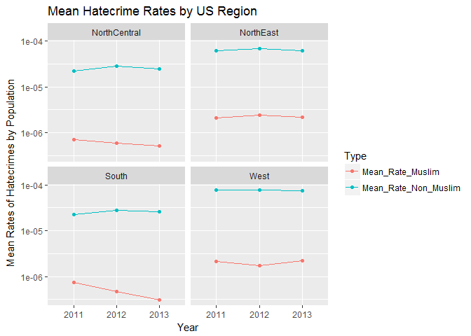

Mean Hatecrime Rates by US Region
================
Theodore Dounias
April 18, 2017

``` r
library(tidyverse)
```

    ## Loading tidyverse: ggplot2
    ## Loading tidyverse: tibble
    ## Loading tidyverse: tidyr
    ## Loading tidyverse: readr
    ## Loading tidyverse: purrr
    ## Loading tidyverse: dplyr

    ## Conflicts with tidy packages ----------------------------------------------

    ## filter(): dplyr, stats
    ## lag():    dplyr, stats

``` r
library(tidyr)
library(lubridate)
```

    ## 
    ## Attaching package: 'lubridate'

    ## The following object is masked from 'package:base':
    ## 
    ##     date

``` r
library(ggplot2)

#Read Incident Files
incidents_df <- read.csv("C:\\Users\\tdounias\\Desktop\\Reed College\\Spring 2017\\MATH 241\\Repositories\\anti-muslim_rhetoric\\data\\hatecrime_incidents_2011to13.csv")
reporting_df <- read.csv("C:\\Users\\tdounias\\Desktop\\Reed College\\Spring 2017\\MATH 241\\Repositories\\anti-muslim_rhetoric\\data\\hatecrime_reporters_2011to13.csv")
popdata_df <- read.csv("C:\\Users\\tdounias\\Desktop\\Reed College\\Spring 2017\\MATH 241\\Repositories\\anti-muslim_rhetoric\\data\\Population_data.csv")

#Create Dataset with regions and hatecrime numbers per year
viz1 <- incidents_df %>%
  mutate(Year = year(Incident_Date), count = 1) %>%
  group_by(State_Code, Year) %>%
  summarize(No_Non_Muslim = sum(Anti_Muslim == "N"), No_Muslim = sum(Anti_Muslim == "Y"))

region <- reporting_df %>%
  filter(State_Code < 51) %>%
  group_by(State_Code, Master_File_Year, Country_Region) %>%
  summarize()

viz1[, 5] <- region[, 3]

#Handle Population Data
total_pop <- popdata_df %>%
  group_by(Geo_STATE) %>%
  summarize(total_pop = sum(SE_T001_001)) %>%
  rename(State_Code = Geo_STATE)

viz1 <- inner_join(viz1, total_pop, by = "State_Code")

#Create dataframe for visualizing
viz1_1 <- viz1 %>%
  mutate(HC_by_pop_nonM = No_Non_Muslim / total_pop, HC_by_pop_M = No_Muslim / total_pop) %>%
  group_by(Country_Region, Year) %>%
  summarize(Mean_Rate_Muslim = mean(HC_by_pop_M), Mean_Rate_Non_Muslim = mean(HC_by_pop_nonM)) %>%
  gather(key = Type, value = Rate, 3, 4)

viz1_1$Year <- as.factor(viz1_1$Year)

#Plot graphics
ggplot(viz1_1, aes(Year, Rate, col = Type, group = Type)) +
  geom_point() + 
  geom_line() +
  facet_wrap(~Country_Region) +
  scale_y_log10() +
  labs(y = "Mean Rates of Hatecrimes by Population", title = "Mean Hatecrime Rates by US Region")
```


