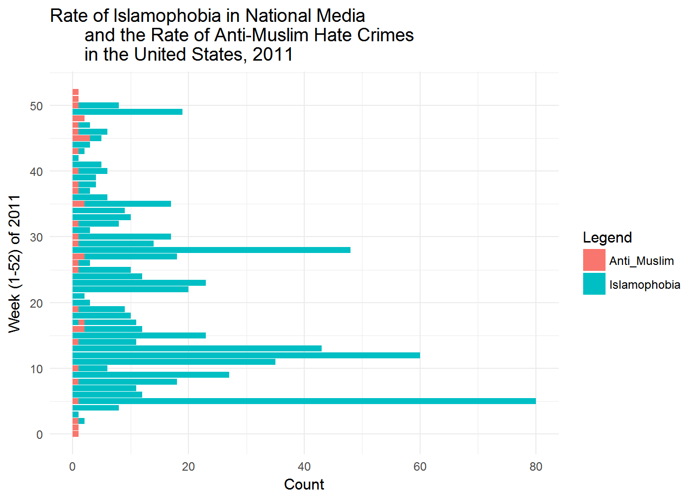
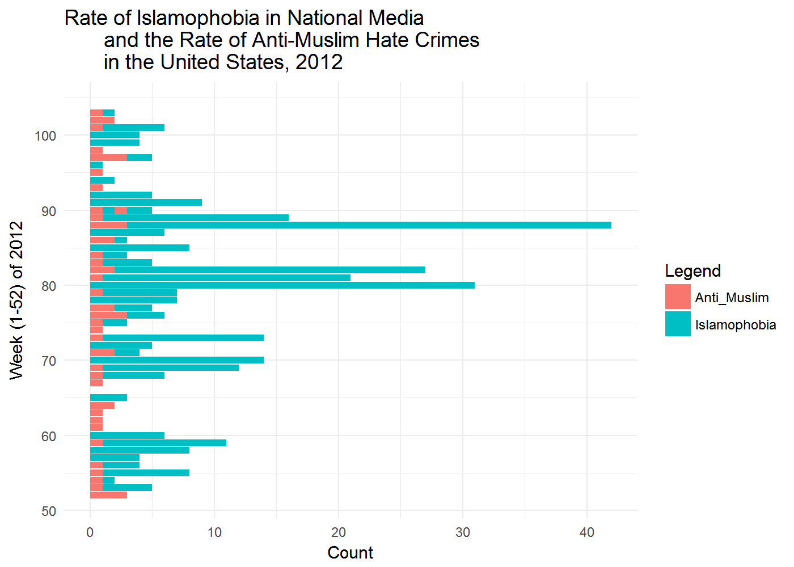
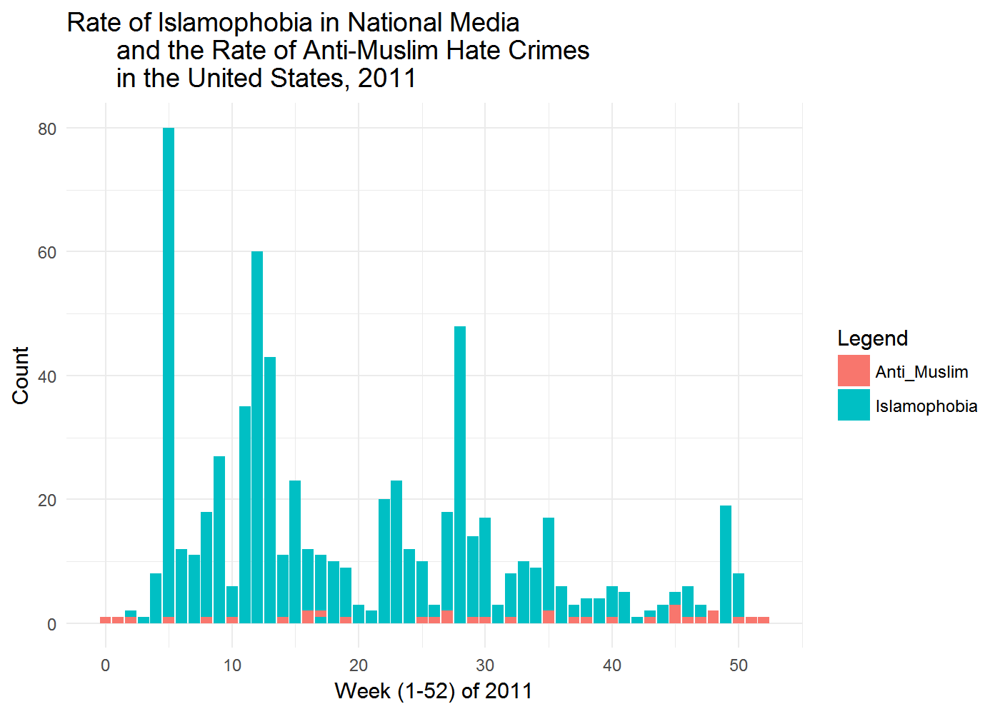
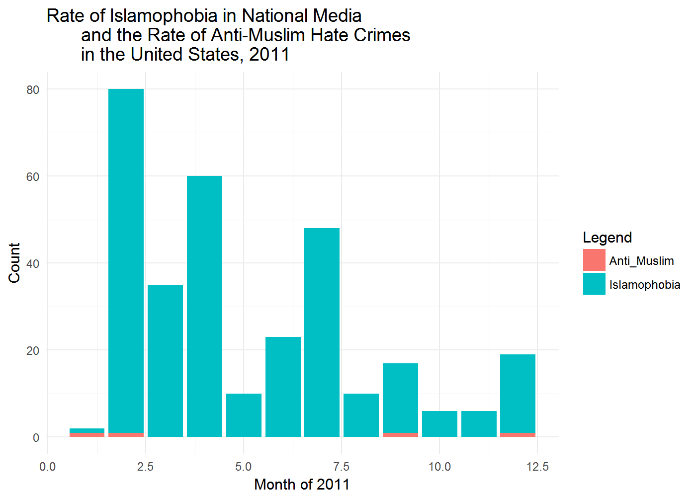
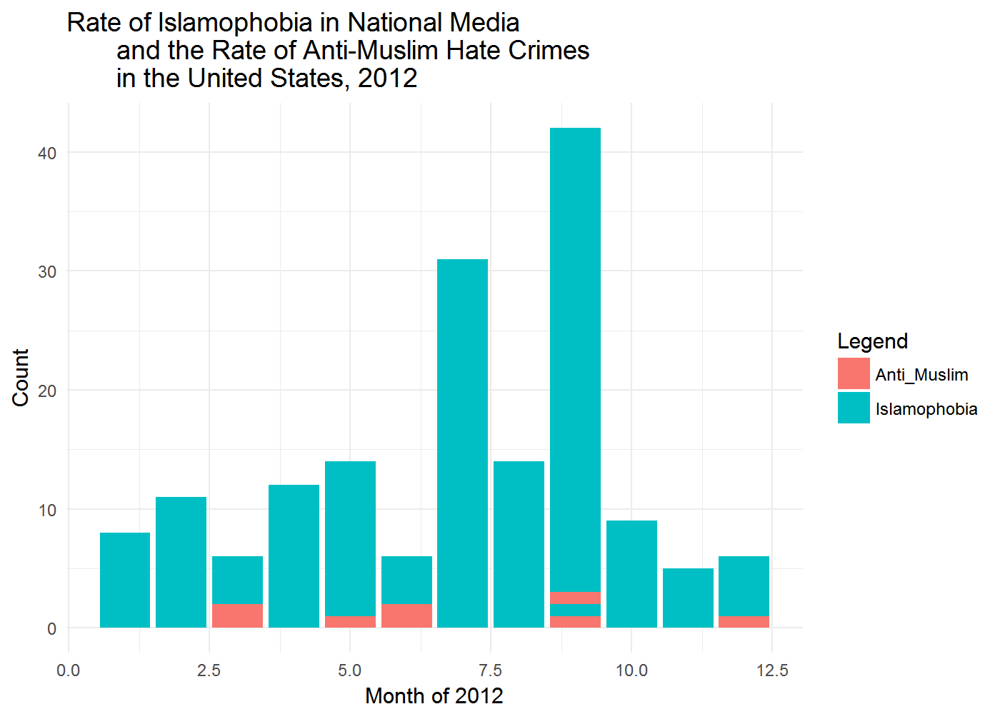
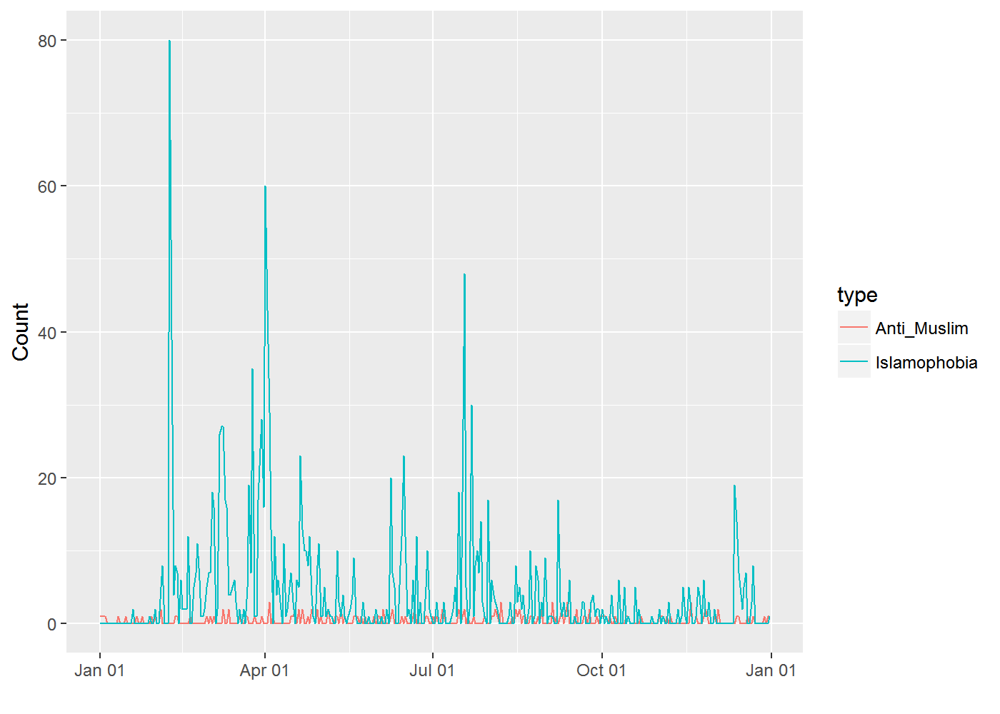
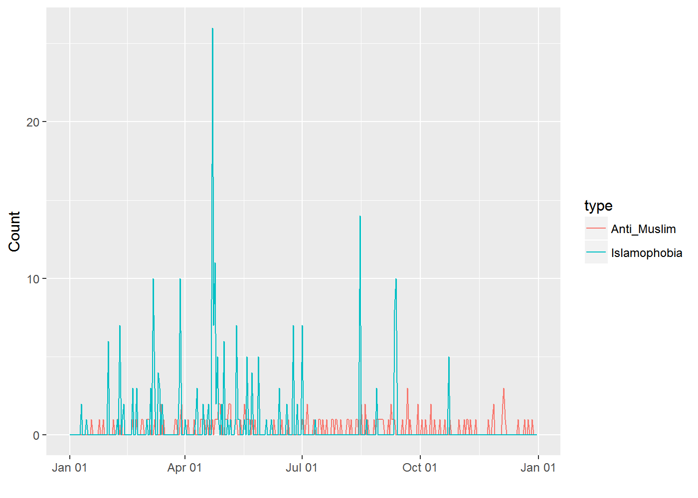
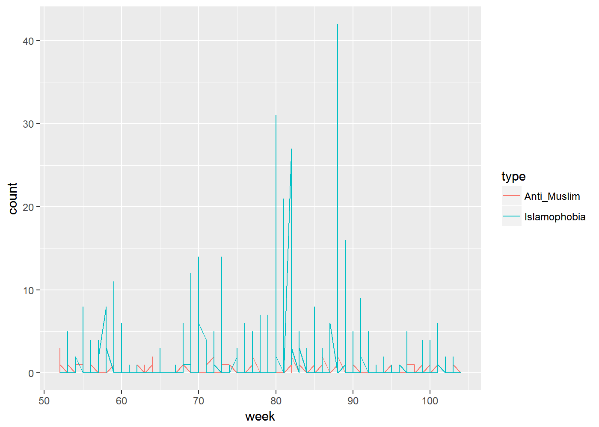

Potential Time Series Visualizations
================

``` r
#Tidying different data sets

new_join <- read_csv("new_join.csv")

new_new_join <- gather(new_join, key = type, value = count, Islamophobia, Anti_Muslim) #Creating "type" variable to plot both sets of data in one visualization

weeks <- new_new_join %>%  #Grouping by week
  mutate(week = (year(newdate) - year(min(newdate)))*52 + 
                 week(newdate) - week(min(newdate)),
               week2 = (as.numeric(newdate) %/% 7) 
         - (as.numeric(min(newdate)) %/% 7)) %>%
  arrange(newdate)

join_2011 <- filter(weeks, Year == "2011") #Filtering by year from grouped weeks data
join_2012 <- filter(weeks, Year == "2012")
join_2013 <- filter(weeks, Year == "2013")


new_join_month1 <- join_2011 %>% mutate(Month = month(newdate))
new_join_month2 <- join_2012 %>% mutate(Month = month(newdate))
new_join_month3 <- join_2013 %>% mutate(Month = month(newdate))
```

### Bar chart grouped by WEEK and FLIPPED

``` r
#Bar chart with coordinates flipped, by week

ggplot(data = join_2011, aes(x=week, y=count, fill=type), group=type) + 
  geom_bar(stat = "identity", position = "identity") +
coord_flip() +
  theme_minimal() +
  labs(title = "Rate of Islamophobia in National Media 
       and the Rate of Anti-Muslim Hate Crimes 
       in the United States, 2011", x = "Week (1-52) of 2011", y = "Count") + 
  scale_fill_discrete(name="Legend")
```



``` r
ggplot(data = join_2012, aes(x=week, y=count, fill=type), group=type) + 
  geom_bar(stat = "identity", position = "identity") +
  coord_flip() +
  theme_minimal() +
  labs(title = "Rate of Islamophobia in National Media 
       and the Rate of Anti-Muslim Hate Crimes 
       in the United States, 2012", x = "Week (1-52) of 2012", y = "Count") + 
  scale_fill_discrete(name="Legend")
```



``` r
ggplot(data = join_2013, aes(x=week, y=count, fill=type), group=type) + 
  geom_bar(stat = "identity", position = "identity") +
  coord_flip() +
  theme_minimal() +
  labs(title = "Rate of Islamophobia in National Media 
       and the Rate of Anti-Muslim Hate Crimes 
       in the United States, 2013", x = "Week (1-52) of 2013", y = "Count") + 
  scale_fill_discrete(name="Legend")
```


### Bar chart grouped by WEEK

``` r
#Regular bar chart, grouped by week

ggplot(data = join_2011, aes(x=week, y=count, fill=type), group=type) + 
  geom_bar(stat = "identity", position = "identity") +
  theme_minimal() +
  labs(title = "Rate of Islamophobia in National Media 
       and the Rate of Anti-Muslim Hate Crimes 
       in the United States, 2011", x = "Week (1-52) of 2011", y = "Count") + 
  scale_fill_discrete(name="Legend")
```



``` r
ggplot(data = join_2012, aes(x=week, y=count, fill=type), group=type) + 
  geom_bar(stat = "identity", position = "identity") +
  theme_minimal() +
  labs(title = "Rate of Islamophobia in National Media 
       and the Rate of Anti-Muslim Hate Crimes 
       in the United States, 2012", x = "Week (1-52) of 2012", y = "Count") + 
  scale_fill_discrete(name="Legend")
```


``` r
ggplot(data = join_2013, aes(x=week, y=count, fill=type), group=type) + 
  geom_bar(stat = "identity", position = "identity") +
  theme_minimal() +
  labs(title = "Rate of Islamophobia in National Media 
       and the Rate of Anti-Muslim Hate Crimes 
       in the United States, 2013", x = "Week (1-52) of 2013", y = "Count") + 
  scale_fill_discrete(name="Legend")
```


### Bar chart grouped by MONTH

``` r
ggplot(data = new_join_month1, aes(x=Month, y=count, fill=type), group=type) + 
  geom_bar(stat = "identity", position = "identity") +
  theme_minimal() +
  labs(title = "Rate of Islamophobia in National Media 
       and the Rate of Anti-Muslim Hate Crimes 
       in the United States, 2011", x = "Month of 2011", y = "Count") + 
  scale_fill_discrete(name="Legend")
```



``` r
ggplot(data = new_join_month2, aes(x=Month, y=count, fill=type), group=type) + 
  geom_bar(stat = "identity", position = "identity") +
  theme_minimal() +
  labs(title = "Rate of Islamophobia in National Media 
       and the Rate of Anti-Muslim Hate Crimes 
       in the United States, 2012", x = "Month of 2012", y = "Count") + 
  scale_fill_discrete(name="Legend")
```



``` r
ggplot(data = new_join_month3, aes(x=Month, y=count, fill=type), group=type) + 
  geom_bar(stat = "identity", position = "identity") +
  theme_minimal() +
  labs(title = "Rate of Islamophobia in National Media 
       and the Rate of Anti-Muslim Hate Crimes 
       in the United States, 2013", x = "Month of 2013", y = "Count") + 
  scale_fill_discrete(name="Legend")
```


### Line chart grouped by DAY

``` r
#This a line plot grouped by DAY

ggplot(data = join_2011, aes(x=newdate, y=count, col=type)) + geom_line() +
  scale_x_date(date_labels = "%b %d") + xlab("") + ylab("Count")
```



``` r
ggplot(data = join_2012, aes(x=newdate, y=count, col=type)) + geom_line() +
  scale_x_date(date_labels = "%b %d") + xlab("") + ylab("Count")
```


``` r
ggplot(data = join_2013, aes(x=newdate, y=count, col=type)) + geom_line() +
  scale_x_date(date_labels = "%b %d") + xlab("") + ylab("Count")
```



### Line chart grouped by WEEK

``` r
#Grouped by WEEK

ggplot(data = join_2011, aes(x=week, y=count, col=type)) + geom_line() 
```


``` r
ggplot(data = join_2012, aes(x=week, y=count, col=type)) + geom_line() 
```



``` r
ggplot(data = join_2013, aes(x=week, y=count, col=type)) + geom_line() 
```


