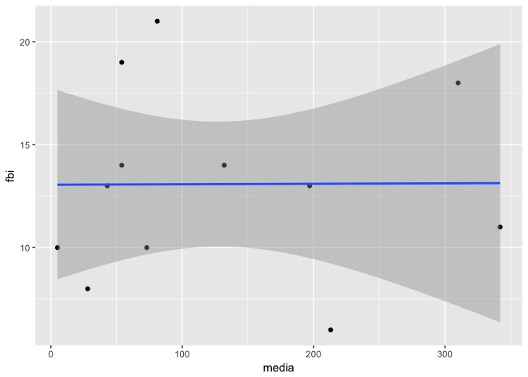
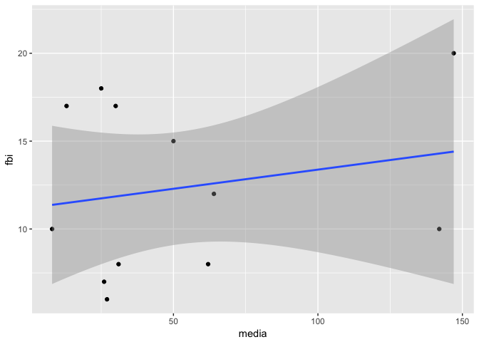
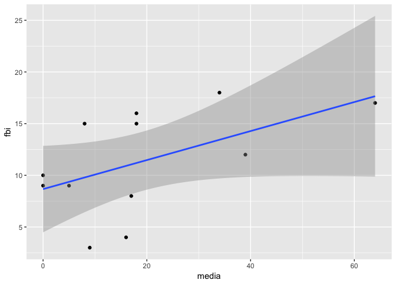

Is Anti-Muslim Rhetoric in the Media a Predictor for Increased Hate Crimes? A Preliminary Analysis
================
Emily Clark, Theodore Dounias, Kristina Kutateli

Motivating Question
-------------------

While there is a sizeable literature in sociology and political science on potential causes of anti-Muslim hate crimes in the US and UK, there are few studies that actually attempt to find the causes and correlates of hate crimes in the US using statistical analysis. By using data on the rates of anti-Muslim rhetoric in the media, we ask whether anti-Muslim rhetoric in the media is correlated with anti-Muslim hate crimes.

Our Data
--------

We utilize two sets of data in this preliminary analysis. Firstly, we use FBI's UCR data. State-level data on religiously-motivated anti-Muslim hate crimes is available from the Federal Bureau of Investigation’s Uniform Crime Reporting Program. Incident-level data on hate crimes is available from NIBRS (National Incident Based Reporting System).

The official reports filed with the FBI are regarded as the “best source of national hate crime data,” and they are used commonly by researchers analyzing hate crimes. Hate crimes include murder, non-negligent manslaughter, rape, aggravated assault, simple assault, intimidation, robbery, burglary, larceny-theft, motor vehicle theft, arson, destruction, damage, vandalism, and crimes against society (Federal Bureau of Investigation, 2012).

Secondly, we utilize ReThink Media's collected data set on the level of anti-Muslim rhetoric in national, mainstream media (FOX news, NYTimes, etc.). ReThink developed a search string that captures relevant news stories, and then runs that search string in Nexis and Factiva each morning to pull in news articles from a set list of national news outlets, discarding any that are irrelevant. They then highlight each quotation in each news article, and then they code for the source (speaker), message (topic), and sentiment of each quotation.

Anti-Muslim rhetoric can range from problematic attitudes towards Muslims (e.g., Muslim communities must be partners to law enforcement in the war on terrorism) to outright bigotry (e.g., not all Muslims are terrorists but most terrorists are Muslim).

Tidying/joining the data, analyzing the data
--------------------------------------------

We first pulled relevant columns from both data sets and then grouped by month to join the two data sets. There is a joined data set for each year.

To analyze the data, we ran a linear regression to test whether there was a strong linear relationship between the FBI-recorded hate crimes and anti-Muslim rhetoric, by month. We also provide a scatterplot for each year.

``` r
#Tidying the ReThink Data

colnames(data) <- as.character(unlist(data[1,]))
data = data[-1, ] #Making first line of data the column headers

new_data <- select(data, Date, Islamophobia) #Selecting relevant columns 

new_rethink <- new_data %>% 
  mutate (Year = year(mdy(Date)), 
          Month = month (mdy(Date))) #Creating Month and Year columns

new_rethink$Islamophobia <- as.integer(new_rethink$Islamophobia) #Making Islamophobia column an "integer"

rethink_2011 <- filter(new_rethink, Year == "2011") #Separating by year
rethink_2011 <- aggregate(rethink_2011$Islamophobia, 
                          by=list(Month=rethink_2011$Month), 
                          FUN=sum) #Creating data set for sum of anti-muslim rhetoric per month

rethink_2012 <- filter(new_rethink, Year == "2012")
rethink_2012 <- aggregate(rethink_2012$Islamophobia, 
                          by=list(Month=rethink_2012$Month), 
                          FUN=sum)

rethink_2013 <- filter(new_rethink, Year == "2013")
rethink_2013 <- aggregate(rethink_2013$Islamophobia, 
                          by=list(Month=rethink_2013$Month), 
                          FUN=sum)
```

``` r
#Tidying FBI data

new_fbi <- select(fbi_data, Incident_Date, Anti_Muslim)

new_fbi <- filter(new_fbi, Anti_Muslim == "Y")

new_new <- new_fbi %>% 
  mutate(Year = year(Incident_Date), 
         Month = month(Incident_Date), 
         count = 1) 

fbi_2011 <- filter(new_new, Year == "2011")
fbi_2011 <- aggregate(fbi_2011$count, 
                      by=list(Month=fbi_2011$Month), 
                      FUN=sum)

fbi_2012 <- filter(new_new, Year == "2012")
fbi_2012 <- aggregate(fbi_2012$count, 
                      by=list(Month=fbi_2012$Month), 
                      FUN=sum)

fbi_2013 <- filter(new_new, Year == "2013")
fbi_2013 <- aggregate(fbi_2013$count, 
                      by=list(Month=fbi_2013$Month), 
                      FUN=sum)
```

``` r
join_2011 <- fbi_2011 %>% inner_join(rethink_2011, by = c("Month" = "Month"))
join_2012 <- fbi_2012 %>% inner_join(rethink_2012, by = c("Month" = "Month"))
join_2013 <- fbi_2013 %>% inner_join(rethink_2013, by = c("Month" = "Month"))

join_2011$fbi <- join_2011$x.x
join_2011$media <- join_2011$x.y

join_2012$fbi <- join_2012$x.x
join_2012$media <- join_2012$x.y

join_2013$fbi <- join_2013$x.x
join_2013$media <- join_2013$x.y

join_2011$Month <- as.factor(join_2011$Month)
join_2012$Month <- as.factor(join_2012$Month)
join_2013$Month <- as.factor(join_2013$Month)
```

``` r
ggplot(data = join_2011, aes(media, fbi)) + geom_point() + geom_smooth(method=lm)
```



``` r
summary(lm(join_2011$fbi ~ join_2011$media))
```

    ## 
    ## Call:
    ## lm(formula = join_2011$fbi ~ join_2011$media)
    ## 
    ## Residuals:
    ##     Min      1Q  Median      3Q     Max 
    ## -7.1025 -3.0596 -0.0816  1.9188  7.9272 
    ## 
    ## Coefficients:
    ##                  Estimate Std. Error t value Pr(>|t|)    
    ## (Intercept)     1.305e+01  2.113e+00   6.180 0.000104 ***
    ## join_2011$media 2.247e-04  1.264e-02   0.018 0.986171    
    ## ---
    ## Signif. codes:  0 '***' 0.001 '**' 0.01 '*' 0.05 '.' 0.1 ' ' 1
    ## 
    ## Residual standard error: 4.721 on 10 degrees of freedom
    ## Multiple R-squared:  3.158e-05,  Adjusted R-squared:  -0.09997 
    ## F-statistic: 0.0003158 on 1 and 10 DF,  p-value: 0.9862

``` r
ggplot(data = join_2012, aes(media, fbi)) + geom_point() + geom_smooth(method=lm)
```



``` r
summary(lm(join_2012$fbi ~ join_2012$media))
```

    ## 
    ## Call:
    ## lm(formula = join_2012$fbi ~ join_2012$media)
    ## 
    ## Residuals:
    ##     Min      1Q  Median      3Q     Max 
    ## -5.7864 -4.3580 -0.9826  5.2409  6.2573 
    ## 
    ## Coefficients:
    ##                 Estimate Std. Error t value Pr(>|t|)    
    ## (Intercept)     11.19758    2.20962   5.068 0.000486 ***
    ## join_2012$media  0.02181    0.03225   0.676 0.514247    
    ## ---
    ## Signif. codes:  0 '***' 0.001 '**' 0.01 '*' 0.05 '.' 0.1 ' ' 1
    ## 
    ## Residual standard error: 4.973 on 10 degrees of freedom
    ## Multiple R-squared:  0.04373,    Adjusted R-squared:  -0.0519 
    ## F-statistic: 0.4572 on 1 and 10 DF,  p-value: 0.5142

``` r
ggplot(data = join_2013, aes(media, fbi)) + geom_point() + geom_smooth(method=lm)
```



``` r
summary(lm(join_2013$fbi ~ join_2013$media))
```

    ## 
    ## Call:
    ## lm(formula = join_2013$fbi ~ join_2013$media)
    ## 
    ## Residuals:
    ##     Min      1Q  Median      3Q     Max 
    ## -6.9295 -2.3688 -0.0171  3.9955  5.2108 
    ## 
    ## Coefficients:
    ##                 Estimate Std. Error t value Pr(>|t|)    
    ## (Intercept)      8.66614    1.87717   4.617 0.000956 ***
    ## join_2013$media  0.14038    0.07209   1.947 0.080118 .  
    ## ---
    ## Signif. codes:  0 '***' 0.001 '**' 0.01 '*' 0.05 '.' 0.1 ' ' 1
    ## 
    ## Residual standard error: 4.446 on 10 degrees of freedom
    ## Multiple R-squared:  0.2749, Adjusted R-squared:  0.2024 
    ## F-statistic: 3.792 on 1 and 10 DF,  p-value: 0.08012
